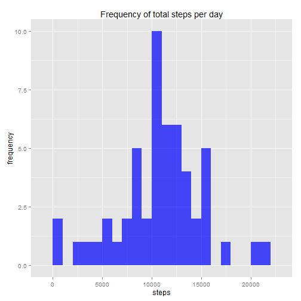
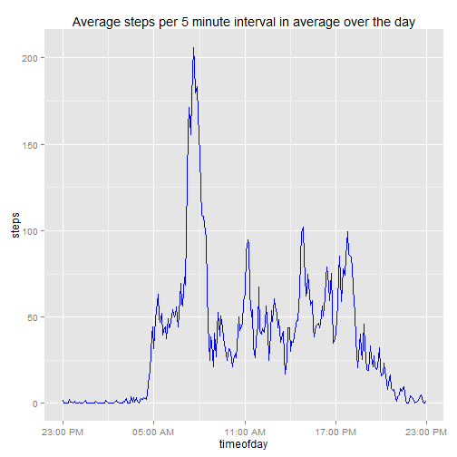
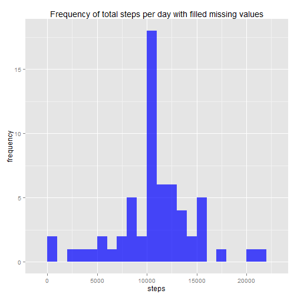
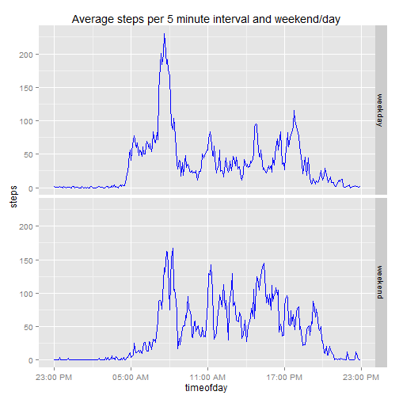

# Introduction

This assignment makes use of data from a personal activity monitoring device. This device collects data at 5 minute intervals through out the day. The data consists of two months of data from an anonymous individual collected during the months of October and November, 2012 and include the number of steps taken in 5 minute intervals each day.

Note: As we want to show the code of all R calculations we set a global variable:


```r
library(knitr)
opts_chunk$set(echo=TRUE)
```

Loading the necessary packages:


```r
library(dplyr)
library(lubridate)
library(ggplot2)
library(scales)
```

# Loading and preprocessing the data

## Reading the data

Note: It is assumed that the data is already downloaded and saved to the working directory.  If not, please download the code [here](https://d396qusza40orc.cloudfront.net/repdata%2Fdata%2Factivity.zip), unzip it and save it to your working directory.


```r
activity <- read.csv("activity.csv", header=TRUE,sep=',',colClasses =c("numeric","character","integer"))
head(activity)
```

```
##   steps       date interval
## 1    NA 2012-10-01        0
## 2    NA 2012-10-01        5
## 3    NA 2012-10-01       10
## 4    NA 2012-10-01       15
## 5    NA 2012-10-01       20
## 6    NA 2012-10-01       25
```

```r
str(activity)
```

```
## 'data.frame':	17568 obs. of  3 variables:
##  $ steps   : num  NA NA NA NA NA NA NA NA NA NA ...
##  $ date    : chr  "2012-10-01" "2012-10-01" "2012-10-01" "2012-10-01" ...
##  $ interval: int  0 5 10 15 20 25 30 35 40 45 ...
```

The variables included in this dataset are:

- **steps**: Number of steps taking in a 5-minute interval (missing values are coded as *NA*)
- **date**: The date on which the measurement was taken in YYYY-MM-DD format
- **interval**: Identifier for the 5-minute interval in which measurement was taken

## Transforming the date variable


```r
activity$date <- ymd(activity$date)
head(activity)
```

```
##   steps       date interval
## 1    NA 2012-10-01        0
## 2    NA 2012-10-01        5
## 3    NA 2012-10-01       10
## 4    NA 2012-10-01       15
## 5    NA 2012-10-01       20
## 6    NA 2012-10-01       25
```

```r
str(activity)
```

```
## 'data.frame':	17568 obs. of  3 variables:
##  $ steps   : num  NA NA NA NA NA NA NA NA NA NA ...
##  $ date    : POSIXct, format: "2012-10-01" "2012-10-01" ...
##  $ interval: int  0 5 10 15 20 25 30 35 40 45 ...
```

```r
activity <- transform(activity, 
                      datetime = strptime( paste(date,formatC(interval,width=4,flag="0")), "%Y-%m-%d %H%M"),
                      timeofday = strptime( paste("1970-01-01",formatC(interval,width=4,flag="0")), "%Y-%m-%d %H%M"))
str(activity)
```

```
## 'data.frame':	17568 obs. of  5 variables:
##  $ steps    : num  NA NA NA NA NA NA NA NA NA NA ...
##  $ date     : POSIXct, format: "2012-10-01" "2012-10-01" ...
##  $ interval : int  0 5 10 15 20 25 30 35 40 45 ...
##  $ datetime : POSIXct, format: "2012-10-01 00:00:00" "2012-10-01 00:05:00" ...
##  $ timeofday: POSIXct, format: "1970-01-01 00:00:00" "1970-01-01 00:05:00" ...
```

# What is the mean total number of steps taken per day?

The missing values in the dataset will be ignored.

## Calculate the total number of steps taken per day


```r
stepsPerDay <- aggregate(steps ~ date, data=activity, FUN=sum)
```

## Make a histogram of the total number of steps taken each day


```r
p <- ggplot(stepsPerDay, aes(steps))
p <- p + geom_histogram(binwidth=1000,fill="blue",alpha=0.7)
p <- p + labs(y="frequency", title="Frequency of total steps per day")
print(p)
```

 

## Calculate and report the mean and median of the total number of steps taken per day


```r
mean(stepsPerDay$steps)
```

```
## [1] 10766.19
```

```r
median(stepsPerDay$steps)
```

```
## [1] 10765
```

# What is the average daily activity pattern

## Make a time series plot


```r
avgStepsPerTime <- aggregate(steps ~ timeofday,data=activity,FUN=mean)
p <- ggplot(avgStepsPerTime,aes(timeofday,steps))
p <- p + geom_line(color="blue")
p <- p + scale_x_datetime(labels=date_format("%H:%M %p"))
p <- p + labs(title="Average steps per 5 minute interval in average over the day")
print(p)
```

 

On average the number of steps are peaking in the morning.

## Which 5-minute interval contains the maximum number of steps


```r
avgStepsPerTime[which.max(avgStepsPerTime$steps),]
```

```
##               timeofday    steps
## 104 1970-01-01 08:35:00 206.1698
```

The peak is from 8:35 to 8:40 in the morning.

# Imputing missing values

## Calculate and report the total number of missing values


```r
sum(is.na(activity$steps))
```

```
## [1] 2304
```

## Filling the missing values in the dataset

Missing values can skew the results. Therefore missing values in a 5 minute interval will be replaced by the average value of this 5 minute interval.

## Creating a new dataset with filled missing values


```r
activity.filled <- inner_join(activity,avgStepsPerTime,by="timeofday")
missing.values <- is.na(activity.filled$steps.x)
activity.filled$steps.x[missing.values] <- activity.filled$steps.y[missing.values]
activity.filled <- transform(activity.filled,steps=steps.x,steps.x=NULL,steps.y=NULL)
```

## Make a histogram of the total number of steps taken each day for the dataset with filled missing values


```r
stepsPerDay.filled <- aggregate(steps ~ date, data=activity.filled, FUN=sum)
p <- ggplot(stepsPerDay.filled, aes(steps))
p <- p + geom_histogram(binwidth=1000,fill="blue",alpha=0.7)
p <- p + labs(y="frequency", title="Frequency of total steps per day with filled missing values")
print(p)
```

 

## Calculate and report the mean and median of the total number of steps taken per day for the dataset with filled missing values


```r
mean(stepsPerDay.filled$steps)
```

```
## [1] 10766.19
```

```r
median(stepsPerDay.filled$steps)
```

```
## [1] 10766.19
```

The mean number of steps remains the same. The median becomes equal to the mean because the days that previously had missing values were replaced with the mean which is in the middle of the distribution of the steps. As a result all of the days close to the middle of the range of the steps have the mean value.

# Are there differences in activity patterns between weekdays and weekends

## Creating a new factor variable


```r
weekend <- with(activity.filled, ifelse(weekdays(datetime) %in% c("Saturday","Sunday"),"weekend","weekday"))
activity.filled$weekend <- factor(weekend)
steps.byWeekend <- aggregate(steps ~ weekend + timeofday, data=activity.filled,FUN = mean)
```

## Make a panel plot


```r
p <- ggplot(steps.byWeekend,aes(x=timeofday,y=steps))
p <- p + geom_line(col="blue")+facet_grid(weekend~.)
p <- p + scale_x_datetime(labels=date_format("%H:%M %p"))
p <- p + labs(title="Average steps per 5 minute interval and weekend/day")
p
```

 

Interpretation of the plot:
The person gets up earlier during weekdays and has a longer walk at around 8:30.
During weekends the person is more active during the day.
